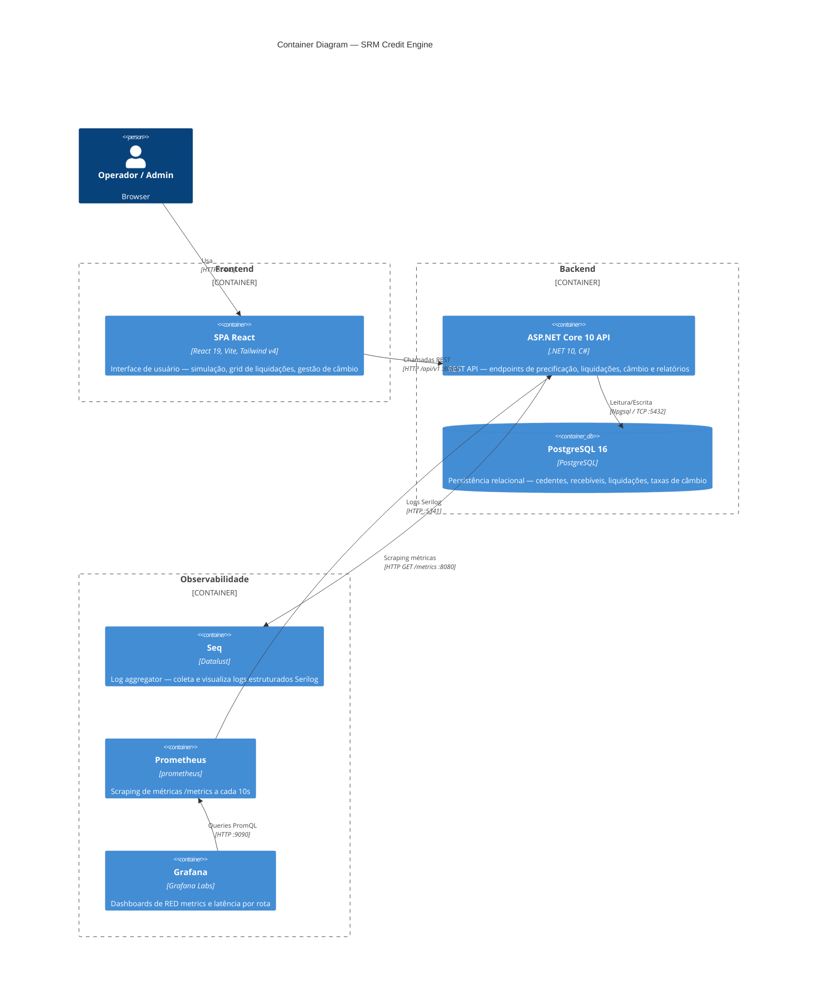

# C4 Level 2 — Container Diagram: SRM Credit Engine



## Descrição dos Containers

### SPA React (Frontend)

| Tecnologia       | Versão | Papel                        |
|------------------|--------|------------------------------|
| React            | 19     | UI components                |
| Vite             | 7      | Build + Dev server           |
| Tailwind CSS     | v4     | Utility-first styling        |
| TanStack Query   | v5     | Server state + cache         |
| TanStack Table   | v8     | Data grid server-side        |
| Zustand          | 5.x    | Client state (currency)      |
| Zod + RHF        | —      | Form validation              |
| Axios            | —      | HTTP client                  |

**Páginas:**
- `OperatorPanel` — simulação de precificação + confirmação de liquidação  
- `TransactionGrid` — grid paginado de liquidações com filtros  
- `ExchangeRates` — consulta e atualização de cotações

### ASP.NET Core API (Backend)

**Organização em camadas:**

```
API Layer         → Controllers, Middleware, Program.cs
Application Layer → Use Cases, Handlers, Validators, DTOs
Domain Layer      → Entities, Value Objects, Domain Services, Exceptions
Infrastructure    → EF Core, Dapper, Repositories, UoW
```

**Endpoints expostos:**
- `POST /api/v1/pricing/simulate` — calcula PV e spread
- `GET|POST /api/v1/settlements` — listagem paginada e criação
- `GET /api/v1/settlements/{id}` — detalhes de liquidação
- `GET /api/v1/exchange-rates/{from}/{to}` — cotação atual
- `PUT /api/v1/exchange-rates` — atualiza cotação
- `GET /api/v1/reports/statement` — extrato consolidado
- `GET /health` — health check
- `GET /metrics` — Prometheus scrape endpoint

### PostgreSQL 16

**Schemas / Tabelas principais:**

| Tabela            | Domínio          | Chave natural               |
|-------------------|------------------|-----------------------------|
| `cedents`         | Cedentes         | `document_number` (CNPJ)    |
| `receivables`     | Recebíveis       | `document_number + cedent_id` |
| `settlements`     | Liquidações      | UUID `id`                   |
| `settlement_items`| Itens            | FK → settlement + receivable |
| `exchange_rates`  | Câmbio           | `(from_currency, to_currency)` |

**Features utilizadas:**
- `xmin` — concorrência otimista sem coluna extra
- `TIMESTAMPTZ` — datas em UTC
- Índices parciais em `settlement_status`

---

## Fluxo de Dados: Simulação de Precificação

```
Operator → POST /api/v1/pricing/simulate
         → PricingController
         → SimulatePricingHandler (Application)
         → PricingDomainService.Calculate (Domain)
         → PricingResult { FaceValue, PresentValue, Discount, AppliedSpread }
         → HTTP 200 SimulatePricingResponse
```

## Fluxo de Dados: Confirmação de Liquidação

```
Operator → POST /api/v1/settlements
         → SettlementsController
         → CreateSettlementHandler (Application)
         → IReceivableRepository.GetById (Infrastructure → PostgreSQL)
         → IExchangeRateRepository.GetRate (Infrastructure → PostgreSQL)
         → Money.ConvertTo (Domain)
         → Settlement.CreatePending (Domain Entity)
         → ISettlementRepository.Add + IUnitOfWork.SaveChanges (Infrastructure → PostgreSQL)
         → Settlement.MarkAsSettled (Domain Entity)
         → IUnitOfWork.SaveChanges
         → HTTP 201 SettlementResponse
```

## Próximo Nível

Ver [ADR-001](../adr/ADR-001-net10-clean-arch.md) para justificativa da camada de domínio.  
Ver [docs/high-scale-design.md](../high-scale-design.md) para evolução desta arquitetura a 1M tx/min.
