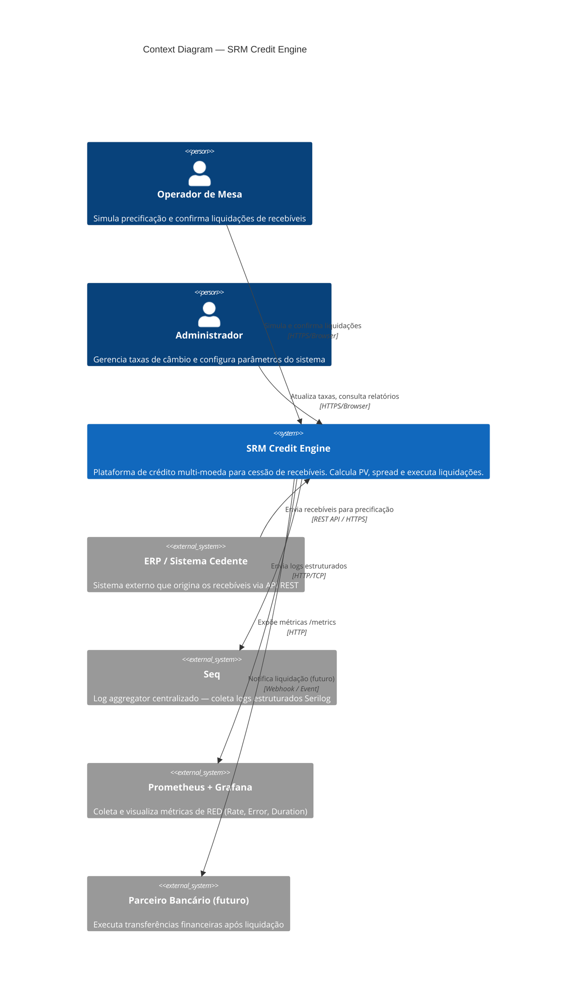

# C4 Level 1 — Context Diagram: SRM Credit Engine

## Descrição dos Atores e Sistemas

### Personas

| Ator             | Papel                                  | Interação Principal                         |
|------------------|----------------------------------------|---------------------------------------------|
| Operador de Mesa | Usuário primário do sistema            | Painel de operação: simula + confirma       |
| Administrador    | Configuração e monitoramento           | Taxas de câmbio, parâmetros globais         |

### Sistema Principal

**SRM Credit Engine** é responsável por:
1. Calcular o Valor Presente (PV) de recebíveis aplicando spread por tipo (`Cheque`, `Duplicata`, `CRI`, `CRA`, `Debenture`)
2. Executar liquidações multi-moeda (BRL, USD, EUR, GBP)
3. Gerenciar conversão cambial com taxas atualizáveis
4. Expor relatórios consolidados de liquidações

### Sistemas Externos

| Sistema              | Tipo              | Protocolo      |
|----------------------|-------------------|----------------|
| ERP / Sistema Cedente | Integration Point | REST API       |
| Seq                  | Log Aggregator    | HTTP Sink      |
| Prometheus           | Metrics Scraper   | HTTP Pull      |
| Grafana              | Visualization     | — (lê Prometheus) |
| Parceiro Bancário    | Future            | Webhook/Event  |

---

## Decisões de Contexto

- **Sem autenticação externa** no MVP (sem OIDC/Auth0): autenticação é apontada para sprint posterior
- **Logs e métricas são sistemas externos**: o monólito não depende de disponibilidade deles para funcionar (circuit breaker implícito via Serilog HTTP sink async)
- **ERP envia recebíveis via REST**: contrato de integração documentado via OpenAPI (Scalar UI)

## Próximo Nível

Ver [C4 Level 2 — Container Diagram](./c4-container.md) para detalhamento interno do sistema.
