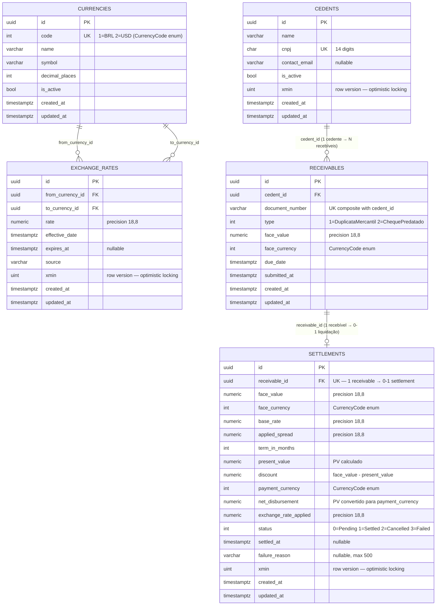

```mermaid
erDiagram
    CURRENCIES {
        uuid id PK
        int  code  UK "1=BRL 2=USD (CurrencyCode enum)"
        varchar name
        varchar symbol
        int decimal_places
        bool is_active
        timestamptz created_at
        timestamptz updated_at
    }

    EXCHANGE_RATES {
        uuid id PK
        uuid from_currency_id FK
        uuid to_currency_id FK
        numeric rate "precision 18,8"
        timestamptz effective_date
        timestamptz expires_at "nullable"
        varchar source
        uint xmin "row version — optimistic locking"
        timestamptz created_at
        timestamptz updated_at
    }

    CEDENTS {
        uuid id PK
        varchar name
        char cnpj UK "14 digits"
        varchar contact_email "nullable"
        bool is_active
        uint xmin "row version — optimistic locking"
        timestamptz created_at
        timestamptz updated_at
    }

    RECEIVABLES {
        uuid id PK
        uuid cedent_id FK
        varchar document_number "UK composite with cedent_id"
        int type "1=DuplicataMercantil 2=ChequePredatado"
        numeric face_value "precision 18,8"
        int face_currency "CurrencyCode enum"
        timestamptz due_date
        timestamptz submitted_at
        timestamptz created_at
        timestamptz updated_at
    }

    SETTLEMENTS {
        uuid id PK
        uuid receivable_id FK "UK — 1 receivable → 0-1 settlement"
        numeric face_value "precision 18,8"
        int face_currency "CurrencyCode enum"
        numeric base_rate "precision 18,8"
        numeric applied_spread "precision 18,8"
        int term_in_months
        numeric present_value "PV calculado"
        numeric discount "face_value - present_value"
        int payment_currency "CurrencyCode enum"
        numeric net_disbursement "PV convertido para payment_currency"
        numeric exchange_rate_applied "precision 18,8"
        int status "0=Pending 1=Settled 2=Cancelled 3=Failed"
        timestamptz settled_at "nullable"
        varchar failure_reason "nullable, max 500"
        uint xmin "row version — optimistic locking"
        timestamptz created_at
        timestamptz updated_at
    }

    CURRENCIES ||--o{ EXCHANGE_RATES : "from_currency_id"
    CURRENCIES ||--o{ EXCHANGE_RATES : "to_currency_id"
    CEDENTS    ||--o{ RECEIVABLES   : "cedent_id (1 cedente → N recebíveis)"
    RECEIVABLES ||--o| SETTLEMENTS  : "receivable_id (1 recebível → 0-1 liquidação)"
```

## Descrição das Entidades

| Entidade | Responsabilidade |
|---|---|
| **CURRENCIES** | Catálogo de moedas suportadas (BRL, USD). `code` é o enum `CurrencyCode` persistido como inteiro. Seed mantido por migration. |
| **EXCHANGE_RATES** | Taxas de câmbio point-in-time. `xmin` garante concorrência otimista na atualização. |
| **CEDENTS** | Empresas cedentes que submetem recebíveis ao fundo. `cnpj` único como chave natural (char 14 dígitos). |
| **RECEIVABLES** | Títulos financeiros (DuplicataMercantil, ChequePredatado) submetidos para precificação. Unique constraint composta em `(document_number, cedent_id)`. |
| **SETTLEMENTS** | Registro imutável da liquidação após precificação. Guarda `base_rate`, `applied_spread`, `present_value`, `net_disbursement` e o `status` via máquina de estados (0=Pending, 1=Settled, 2=Cancelled, 3=Failed). `receivable_id` tem índice único — 1 recebível só pode ter 1 liquidação. |

> **SETTLEMENT_ITEMS e OUTBOX_EVENTS** estão modelados no [high-scale design](../high-scale-design.md)
> e no [EDA proposal](../eda-proposal.md) mas **não existem na migration atual** — são evoluções planejadas.

## Índices Relevantes

| Tabela | Índice | Tipo | Propósito |
|---|---|---|---|
| `cedents` | `ix_cedents_cnpj` | UNIQUE | Integridade do CNPJ |
| `currencies` | `ix_currencies_code` | UNIQUE | Garante enum único |
| `exchange_rates` | `ix_exchange_rates_pair_date` | BTree | Lookup de cotação por par + data |
| `receivables` | `ix_receivables_doc_cedent` | UNIQUE | Evita duplicata por cedente |
| `receivables` | `ix_receivables_due_date` | BTree | Filtro de vencimento |
| `settlements` | `ix_settlements_receivable_id` | UNIQUE | 1 settlement por receivable |
| `settlements` | `ix_settlements_status` | BTree | Filtro por status |
| `settlements` | `ix_settlements_settled_at` | BTree | Filtro temporal |

## Notas de Precisão Numérica

- Valores monetários: `NUMERIC(18, 8)` — 8 casas para suportar frações sub-centavo em conversões cambiais intermediárias. A apresentação ao usuário usa 2 casas decimais.
- Taxas de câmbio: `NUMERIC(18, 8)` — 8 casas decimais para pares exóticos sem perda de precisão.
- Todos os timestamps em UTC (`TIMESTAMPTZ`).
