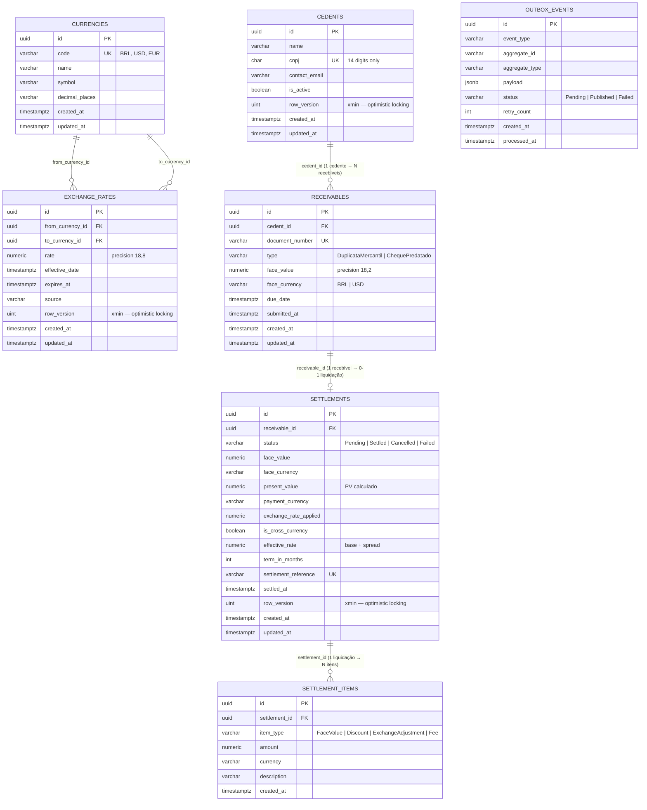

## Descrição das Entidades

| Entidade | Responsabilidade |
|---|---|
| **CURRENCIES** | Catálogo de moedas suportadas (BRL, USD, EUR…). Seed mantido por migration. |
| **EXCHANGE_RATES** | Taxas de câmbio point-in-time. `xmin` garante concorrência otimista na atualização. |
| **CEDENTS** | Empresas cedentes que submetem recebíveis ao fundo. CNPJ único como chave natural. |
| **RECEIVABLES** | Títulos financeiros (duplicatas, cheques) submetidos para precificação. `document_number` único por cedente. |
| **SETTLEMENTS** | Registro imutável da liquidação após precificação. Guarda `present_value`, `exchange_rate_applied` e o status via máquina de estados. |
| **SETTLEMENT_ITEMS** | Ledger de parcelas da liquidação (valor face, desconto, ajuste cambial, taxas). Separação auditável. |
| **OUTBOX_EVENTS** | Padrão Transactional Outbox para publicação assíncrona de eventos de domínio sem Two-Phase Commit. |

## Notas de Precisão Numérica

- Valores monetários: `NUMERIC(18, 2)` — suficiente para negociações até R$ 999 trilhões com centavos exatos.
- Taxas de câmbio: `NUMERIC(18, 8)` — 8 casas decimais para pares exóticos sem perda de precisão.
- Todos os timestamps em UTC (`TIMESTAMPTZ`).
